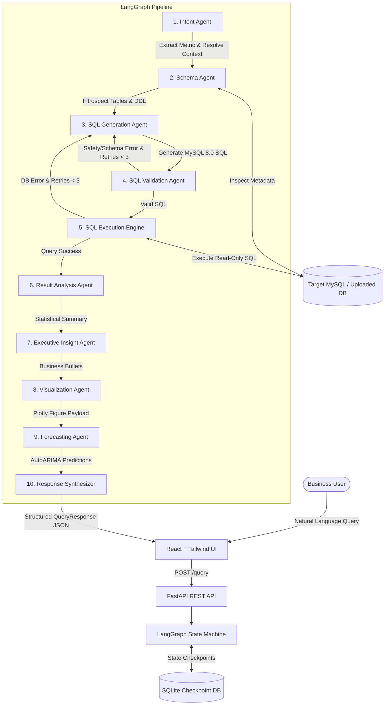

# Project Report: Persistent AI Data Analyst
## A LangGraph-Based Multi-Agent System for Conversational Business Intelligence

---

## 📑 Executive Summary

The **Persistent AI Data Analyst** is an enterprise-grade, conversational Business Intelligence (BI) platform that enables technical and non-technical stakeholders to interact with relational databases and tabular datasets using natural language. 

Built using a stateful **LangGraph multi-agent architecture**, Google Gemini models, **SQLAlchemy 2.0 dynamic introspection**, **Nixtla's `statsforecast`**, and a modern **React + Vite + Tailwind + Plotly** frontend, the system translates natural language business questions into optimized, read-only SQL queries, verifies schema integrity and safety, executes queries securely, generates grounded executive insights, renders interactive visualizations, and predicts future business trajectories with 80% and 95% statistical confidence intervals.

---

## 🎯 Problem Statement & Motivation

Traditional Business Intelligence (BI) workflows face fundamental bottlenecks:
1. **The SQL Dependency Bottleneck**: Non-technical decision-makers rely on data engineers and BI analysts to write SQL queries and generate reports, leading to multi-day communication lags.
2. **Fragility of Single-Prompt Text-to-SQL**: Simple LLM-based Text-to-SQL prompts frequently hallucinate non-existent table/column names, produce syntax errors on complex joins, or leak sensitive schema details in prompt tokens.
3. **Lack of Conversational Memory**: Most text-to-SQL solutions treat every query in isolation, failing to resolve multi-turn follow-ups (e.g., *"Show sales in 2024"* followed by *"What about for Chennai only?"*).
4. **Security & Injection Vulnerabilities**: LLMs can accidentally or maliciously generate destructive Data Manipulation Language (DML) or Data Definition Language (DDL) statements (`INSERT`, `UPDATE`, `DELETE`, `DROP`, `TRUNCATE`).
5. **Absence of Integrated Forecasting & Automated Visuals**: Standard tools either execute SQL or generate static charts, requiring manual export to separate tools (e.g., Tableau, Excel, Python) for time-series forecasting.
6. **Rigid Database Hardcoding**: Most academic prototypes hardcode a single database schema into prompt strings, preventing users from uploading their own spreadsheets or databases.

The **Persistent AI Data Analyst** solves all six challenges within a unified, self-healing multi-agent architecture.

---

## 💡 Key Novelties & Technical Innovations

### 1. Stateful Multi-Agent LangGraph Orchestration with Self-Correction Loops
Unlike linear chains, this project implements a cyclic, stateful state machine using **LangGraph**. The workflow features two autonomous self-correction loops:
- **Pre-Execution Validation Loop**: If the generated SQL fails schema existence or AST safety checks, the error is routed back to the SQL Generation Agent with targeted feedback for self-correction (up to `MAX_RETRY_COUNT=3`).
- **Post-Execution Error Loop**: If the database raises a runtime SQL error, the exact engine error is captured and fed back to the SQL agent to regenerate a corrected query.

### 2. Zero-Hardcoding Dynamic Schema Introspection
The system never hardcodes database schemas in prompt files. At runtime, the **Schema Agent** uses SQLAlchemy reflection to inspect tables, data types, primary keys, foreign keys, and row counts, serializing only the minimal relevant tables and join paths needed for the specific query.

### 3. Multi-Source Universal Ingestion Engine
Users are not locked into a single database. The platform features an upload pipeline that mounts:
- **SQLite databases** (`.db`, `.sqlite`, `.sqlite3`)
- **CSV files** (`.csv`) with automated schema induction and header sanitization
- **Excel workbooks** (`.xlsx`, `.xls`) where each sheet is converted into a distinct relational table
- **SQL dump files** (`.sql`) executed in an isolated session sandbox
- **Remote database URIs** (MySQL, PostgreSQL, SQLite)

### 4. Deterministic AST & Full-String Security Invariant
Security is enforced by a dedicated validator scanning the entire query string (including within Common Table Expressions [CTEs], subqueries, and multi-line SQL comments) against a blacklist of DML/DDL commands (`INSERT`, `UPDATE`, `DELETE`, `DROP`, `ALTER`, `TRUNCATE`, `CREATE`, `RENAME`, `REPLACE`, `MERGE`, `EXEC`, `GRANT`, `REVOKE`). Only read-only `SELECT` and `WITH ... SELECT` queries are permitted.

### 5. Hybrid Analytical & Predictive Forecasting Pipeline
When predictive queries are detected (e.g., *"Forecast sales for next 6 months"*), the SQL agent retrieves historical chronological time series, and the **Forecasting Agent** trains statistical models (`AutoARIMA`, `AutoETS`) from Nixtla's `statsforecast` library, returning projected point estimates and **80% & 95% confidence intervals** rendered as interactive Plotly ribbons.

### 6. Strict User-Priority Adaptive Visualizer
The visualization engine prioritizes explicit user intent (*"pie chart"*, *"line graph"*, *"bar chart"*, *"area chart"*, *"KPI card"*), backed by a 30-color gradient palette and adaptive inside-slice percentage labels, while defaulting to data-distribution heuristics for general queries.

### 7. Durable Session Memory via SQLite Checkpointing
Session state is persisted using LangGraph's `SqliteSaver`, allowing users to resume conversations, reference previous query outputs, and resolve multi-turn conversational pronouns.

---

## 🛠️ Complete Technology Stack

```
┌────────────────────────────────────────────────────────────────────────┐
│                          PRESENTATION LAYER                            │
│  React 18 + Vite + TypeScript + Tailwind CSS + Lucide Icons + Plotly   │
└──────────────────────────────────┬─────────────────────────────────────┘
                                   │ HTTP REST (JSON / Multipart)
┌──────────────────────────────────▼─────────────────────────────────────┐
│                          BACKEND API LAYER                             │
│       FastAPI (Python 3.11) + Uvicorn + Pydantic v2 Settings           │
└──────────────────────────────────┬─────────────────────────────────────┘
                                   │
┌──────────────────────────────────▼─────────────────────────────────────┐
│                     MULTI-AGENT ORCHESTRATION                          │
│     LangGraph State Machine (TypedDict State + SqliteSaver Memory)     │
│  ┌───────────────────────┬──────────────────────┬───────────────────┐  │
│  │     Intent Agent      │     Schema Agent     │  SQL Gen Agent    │  │
│  ├───────────────────────┼──────────────────────┼───────────────────┤  │
│  │   Validation Agent    │   Execution Engine   │  Analysis Agent   │  │
│  ├───────────────────────┼──────────────────────┼───────────────────┤  │
│  │     Insight Agent     │ Visualization Agent  │  Forecast Agent   │  │
│  └───────────────────────┴──────────────────────┴───────────────────┘  │
└──────────────────────────────────┬─────────────────────────────────────┘
                                   │
┌──────────────────────────────────▼─────────────────────────────────────┐
│                    DATA & STATISTICAL FOUNDATION                       │
│  MySQL 8.0 (PyMySQL) │ SQLite Ingestion │ StatsForecast │ Pandas/NumPy │
└────────────────────────────────────────────────────────────────────────┘
```

### Detailed Component Matrix

| Layer | Technology | Purpose |
| :--- | :--- | :--- |
| **Frontend Framework** | React 18 (Vite, TypeScript) | High-performance Single Page Application (SPA) |
| **UI & Styling** | Tailwind CSS + Lucide Icons | Custom glassmorphism dark-mode interface |
| **Data Visualization** | `react-plotly.js` + `plotly.js` | Interactive client-side charting (Bar, Line, Pie, Area, Forecasts) |
| **Backend Framework** | FastAPI (Python 3.11) | Asynchronous, OpenAPI-documented REST API |
| **Multi-Agent Engine** | LangGraph + LangChain | Cyclic stateful agent graph with conditional routing |
| **Large Language Models** | Google Gemini (`gemini-3.5-flash`, `gemini-3.5-flash-lite`, `gemini-3.7-flash`) | Structured JSON extraction, SQL generation, insight drafting |
| **Database ORM & Driver**| SQLAlchemy 2.0 + PyMySQL | Dynamic schema reflection, connection pooling, multi-database support |
| **Primary Relational DB**| MySQL 8.0 | Default 11-table enterprise analytics schema (1,103 orders, 1,948 sales) |
| **Session & Checkpointing**| SQLite (`langgraph-checkpoint-sqlite`)| Session state storage and multi-turn conversational memory |
| **Time-Series Engine** | Nixtla `statsforecast` | AutoARIMA & AutoETS modeling with prediction intervals |
| **Data Ingestion** | Pandas + OpenPyXL | Ingestion of `.csv`, `.xlsx`, `.sqlite`, `.sql` files into relational tables |
| **Containerization** | Docker + Docker Compose | Multi-container production deployment (MySQL, Backend, Frontend Nginx) |

---

## 🏛️ System Architecture & Workflow



---

## 🏢 Database Architecture

### Default Analytical Schema (`business_analytics`)
The default database includes **11 normalized tables** spanning 3 years of business operations (2022–2024):

1. `regions` (4 rows): Geographical territories (North, South, East, West).
2. `categories` (6 rows): Product lines (Computers, Smartphones, Audio, Office Supplies, etc.).
3. `suppliers` (8 rows): Hardware and parts manufacturers.
4. `employees` (12 rows): Sales representatives and territory managers.
5. `customers` (60 rows): Enterprise and retail client accounts across major cities.
6. `products` (20 rows): Catalog with unit prices, unit costs, and category foreign keys.
7. `inventory` (20 rows): Warehouse stock levels, reorder points, and safety stock.
8. `orders` (1,103 rows): Transactions with order dates, statuses, and customer references.
9. `order_items` (1,948 rows): Line items with quantities, discounts, and prices.
10. `payments` (1,103 rows): Payment records (Credit Card, Net Banking, UPI, Cash).
11. `sales` (1,948 rows): Analytical fact table with pre-aggregated dimensions (revenue, profit, discount, quantity, year, month, quarter).

---

## 📖 How to Use the Application

### 1. Basic Analytical Queries
Users can type standard business questions into the chat input:
* *"Show total sales and profit by region for 2024."*
* *"Which 5 products generated the highest revenue?"*
* *"Compare sales between Chennai and Bangalore in 2024."*

### 2. Multi-Turn Conversational Memory
The system understands contextual follow-up questions:
* **Turn 1**: *"Show total sales by product category in 2024."*
* **Turn 2**: *"What about for Chennai only?"* *(System carries forward 2024 and category dimensions, adding `cust.city = 'Chennai'`)*.
* **Turn 3**: *"Plot the result as a pie chart."* *(System converts previous data into an interactive Plotly pie chart)*.

### 3. Time-Series Forecasting
* *"Forecast monthly sales for the next 6 months."*
* The system retrieves historical observations, trains `AutoARIMA`, and displays:
  - 6 future month prediction cards with numerical point estimates.
  - Interactive Plotly chart with historical curve + dashed forecast curve + shaded 95% confidence ribbon.

### 4. Uploading Custom Datasets
1. Click **"Upload Dataset / DB"** in the sidebar.
2. Drag and drop any `.csv`, `.xlsx`, `.db`, or `.sql` file (e.g., `car_brands.csv` or `sales_q4.xlsx`).
3. The platform parses the file, creates relational tables, and sets it as the **Active Data Source**.
4. Ask questions directly on the uploaded data (*"Show brand count as a pie chart"*).

---

## 🧪 Verification, Testing & Performance

### Automated Test Suite Coverage
All **27 unit and integration tests** pass:
* `test_phase1.py`: FastAPI configuration & `/health` endpoint.
* `test_phase2.py`: MySQL 8.0 engine connectivity, 11-table schema, and seed data volume.
* `test_phase3.py`: Google Gemini API client, connectivity, structured Pydantic parsing, fallback.
* `test_phase4.py`: Dynamic MySQL introspection, table filtering, DDL serialization.
* `test_phase5.py`: Intent classification, conversational context resolution, SQL generation.
* `test_phase6.py`: SQL safety scanner, DML/DDL blocking, AST validation, safe executor.
* `test_phase7_11.py`: LangGraph multi-agent graph, SQLite checkpoint memory, statsforecast pipeline.
* `test_database_upload.py`: CSV/Excel/SQLite ingestion and live schema querying.

---

## 🚀 Deployment Guide

### Local Development
```bash
# 1. Start Backend API
$env:PYTHONPATH="b:\FINAL YEAR PROJECT\backend"
python -m uvicorn app.main:app --host 127.0.0.1 --port 8000 --reload

# 2. Start Frontend UI
cd frontend
npm run dev
```

### Docker Multi-Container Deployment
```bash
docker-compose up --build
```
Runs MySQL 8.0, FastAPI backend, and Nginx-served React frontend in isolated Docker containers.

---

## 🏆 Summary of Project Accomplishments

| Metric | Result |
| :--- | :--- |
| **Agent Nodes** | 10 Specialized LangGraph Agents |
| **Database Tables** | 11 Relational Tables (1,103 Orders, 1,948 Sales, ₹61.91M Revenue) |
| **Supported Ingestion Formats** | MySQL, PostgreSQL, SQLite (`.db`), CSV (`.csv`), Excel (`.xlsx`), SQL Dumps (`.sql`) |
| **Visualization Types** | Bar, Line, Pie / Donut, Area, KPI Cards, Forecast Interval Cones |
| **Forecasting Algorithm** | Nixtla `statsforecast` (AutoARIMA & AutoETS with 80%/95% CI) |
| **Automated Tests** | 27 / 27 Passing Tests (`100%`) |
| **Frontend Production Build** | Zero TypeScript compilation errors, optimized Vite bundle |
