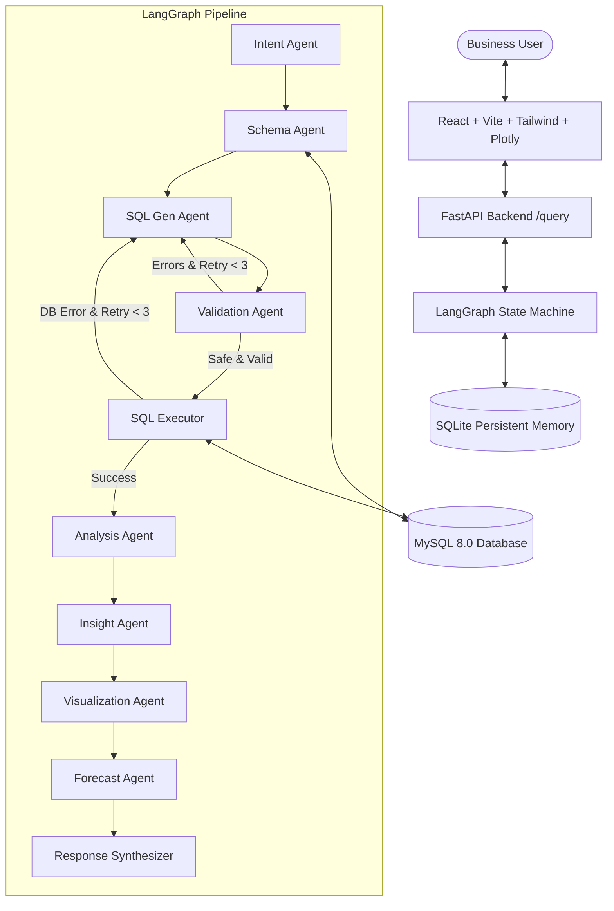

# Persistent AI Data Analyst: A LangGraph-Based Multi-Agent System for Conversational Business Intelligence

[](https://fastapi.tiangolo.com)
[](https://langchain-ai.github.io/langgraph/)
[](https://ai.google.dev/)
[](https://www.mysql.com/)
[](https://react.dev/)
[](https://tailwindcss.com/)
[](https://plotly.com/)

---

## 📌 Project Overview

**Persistent AI Data Analyst** is an enterprise-grade multi-agent platform that translates natural language business questions into optimized, safe MySQL queries, executes them against relational databases, generates grounded statistical explanations and executive insights, renders interactive Plotly charts, predicts future trends with Nixtla's `statsforecast`, and remembers multi-turn conversational context with SQLite checkpointing.

---

## 🚀 Key Capabilities

- 🤖 **LangGraph Multi-Agent Orchestrator**: 10 specialized agent nodes with conditional retry loops for schema selection, SQL generation, AST validation, execution, result analysis, and executive insights.
- 🔍 **Dynamic MySQL Schema Introspection**: Zero hardcoded schema prompts. Automatically inspects table metadata, keys, indexes, and row counts to serialize compact DDL on demand.
- 🛡️ **Strict SQL Safety Engine**: Full-string scanner rejects all DML/DDL keywords (`INSERT`, `UPDATE`, `DELETE`, `DROP`, `ALTER`, `TRUNCATE`) including within CTEs, subqueries, and comments.
- 📊 **Automated Plotly Visualizations**: Auto-selects Bar, Line, Pie, Area, Table, and KPI charts tailored to data distribution and query intent.
- 📈 **Predictive Time-Series Forecasting**: Trains `AutoARIMA` / `AutoETS` models from Nixtla's `statsforecast` to project future horizons with 80% and 95% confidence intervals.
- 🧠 **Persistent Multi-Turn Memory**: Preserves context and conversation threads across follow-up queries using LangGraph `SqliteSaver`.
- 💻 **Modern React + Vite + Tailwind Frontend**: Glassmorphism dark-mode UI with collapsible SQL syntax viewer, copy actions, pagination, and real-time execution latency metrics.

---

## 🏗️ System Architecture



---

## ⚡ Quick Start

### 1. Clone & Install Backend
```bash
python -m venv .venv
.venv\Scripts\activate
pip install -r backend/requirements.txt
pip install langgraph-checkpoint-sqlite aiosqlite
```

### 2. Configure Environment (`backend/.env`)
```ini
GOOGLE_API_KEY=your_gemini_api_key
GEMINI_MODEL=gemini-3.5-flash
DB_HOST=localhost
DB_PORT=3306
DB_NAME=business_analytics
DB_USER=root
DB_PASSWORD=password
```

### 3. Initialize MySQL Database & 3-Year Seed Data
```bash
python database/setup_database.py
```

### 4. Start Application
```bash
# Terminal 1: Backend
$env:PYTHONPATH="backend"
python -m uvicorn app.main:app --host 127.0.0.1 --port 8000 --reload

# Terminal 2: Frontend
cd frontend
npm install
npm run dev
```

### 5. Docker Deployment
```bash
docker-compose up --build
```

---

## 🧪 Testing Suite

Run full automated tests:
```bash
pytest tests/ -v -o "pythonpath=backend"
```
