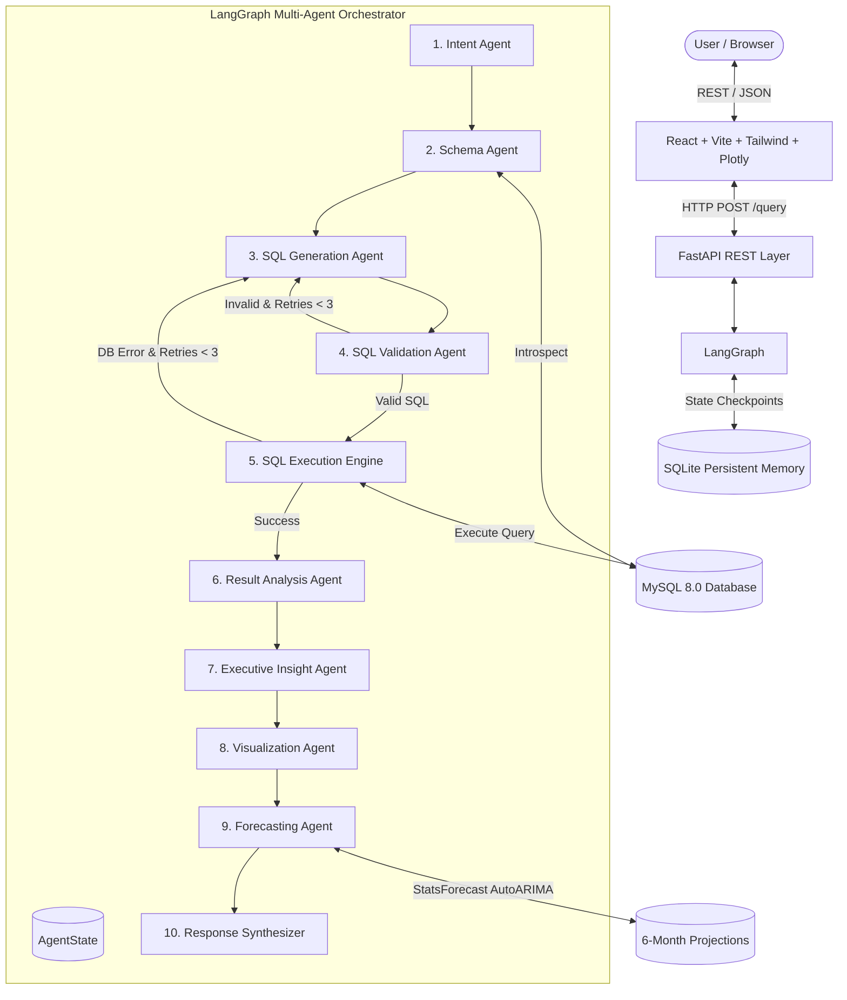

# System Architecture: Persistent AI Data Analyst

**Persistent AI Data Analyst** is a multi-agent Conversational Business Intelligence (BI) platform built with LangGraph, Google Gemini, MySQL 8.0, statsforecast, and React.

---

## 1. High-Level Architecture Diagram

---

## 2. Agent Node Descriptions

| Agent / Module | Role & Responsibility | Implementation File |
| :--- | :--- | :--- |
| **Intent Agent** | Classifies analytical intent (aggregation, ranking, trend, forecast), extracts metrics, dimensions, filters, and resolves conversational follow-ups. | `backend/app/agents/intent_agent.py` |
| **Schema Agent** | Dynamically introspects MySQL metadata without hardcoding DDL, selecting only relevant tables and join paths. | `backend/app/agents/schema_agent.py` |
| **SQL Generation Agent** | Generates read-only MySQL 8.0+ queries with few-shot guidance, date formatting, and self-correction error feedback support. | `backend/app/agents/sql_agent.py` |
| **SQL Validation Agent** | Validates AST syntax, ensures all tables and columns exist in MySQL, and blocks prohibited DML/DDL operations across CTEs and subqueries. | `backend/app/agents/validation_agent.py` |
| **SQL Execution Engine** | Executes validated queries against MySQL with statement timeouts (`QUERY_TIMEOUT=30s`) and row limits (`MAX_RESULT_ROWS=1000`). | `backend/app/database/executor.py` |
| **Result Analysis Agent** | Computes statistical summaries, percentage distributions, period-over-period differences, and grounded explanations. | `backend/app/agents/analysis_agent.py` |
| **Insight Agent** | Produces 3-5 executive-level bullet points highlighting top performers, anomalies, and strategic takeaways. | `backend/app/agents/insight_agent.py` |
| **Visualization Agent** | Inspects column types and intent to automatically construct interactive Plotly figure specifications (Bar, Line, Pie, Area, KPI). | `backend/app/agents/visualization_agent.py` |
| **Forecasting Agent** | Fits Nixtla's `statsforecast` models (AutoARIMA, AutoETS) to historical time-series data with 80% and 95% confidence intervals. | `backend/app/agents/forecast_agent.py` |
| **Persistent Memory** | Uses LangGraph `SqliteSaver` checkpointer to preserve multi-turn state across conversational sessions. | `backend/app/memory/checkpoint.py` |

---

## 3. Database Schema Overview

The relational business database contains **11 normalized tables**:
1. `regions`: Geographical business regions (North, South, East, West).
2. `categories`: Product categories (Electronics, Computers, Office Supplies, etc.).
3. `suppliers`: Hardware and parts vendors.
4. `employees`: Sales representatives and managers with performance targets.
5. `customers`: Enterprise and retail client accounts across major cities.
6. `products`: Product catalog with unit prices and unit costs.
7. `inventory`: Warehouse stock levels and reorder thresholds.
8. `orders`: Order transactions with statuses (Completed, Pending, Cancelled).
9. `order_items`: Line items with quantities and unit prices.
10. `payments`: Payment records (Credit Card, Net Banking, UPI, Cash).
11. `sales`: Denormalized analytical fact table with pre-aggregated metrics across 2022–2024.
